# Crime Analysts
## Objective
We aim to perform an analysis of the crimes that have taken place in the city of Chicago in the last 1 year. To perform this analysis, we looked at the frequency and spatial distributions of various types of crimes. Building upon those observations, we identified regions with an unusual amount of crime, and high arrest rates. Finally, we briefly observed the aggregation of crimes by month.

## Datasets
For this project, we have used the following datasets:
1. Crimes - One year prior to present
2. Boundaries - ZIP Codes
3. Population - 2022

The first dataset, _Crimes - One year prior to present_ contains records of all the crimes that took place in Chicago in the past 1 year. _Boundaries - ZIP Codes_ is a shapefile that has borders of all the districts within Chicago. _Population - 2022_ has population counts for each district.

## Hypotheses
Before beginning our analysis, we came up with the following two hypotheses:

1. The most common type of crime is theft. For example, burglary, motor vehicle theft, or any other kind of stealing.
2. Crimes related to drug abuse take place in secluded regions away from downtown.

## Data Exploration
The Crimes dataset is the most important one for our analysis. It contains important information about the crimes such as the location, time, nature, and severity of the crime. The following screen grabs contain the relevant statistics that describe this dataset.
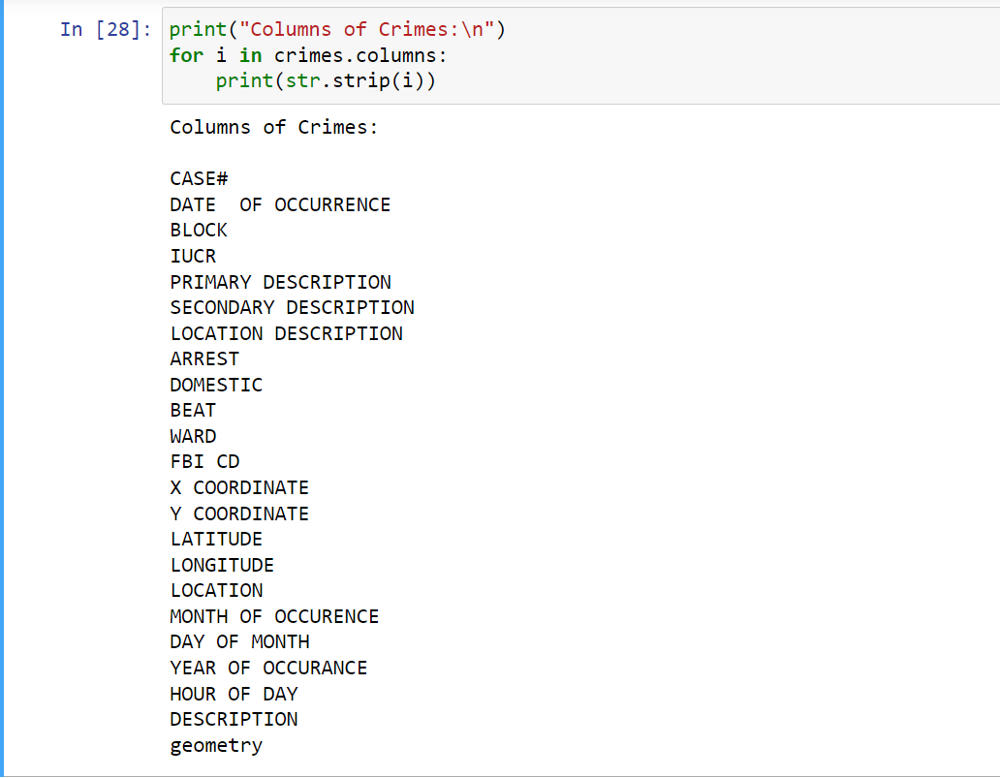
Around 8% of the rows in the dataset had some sort of missing values, we removed these rows.
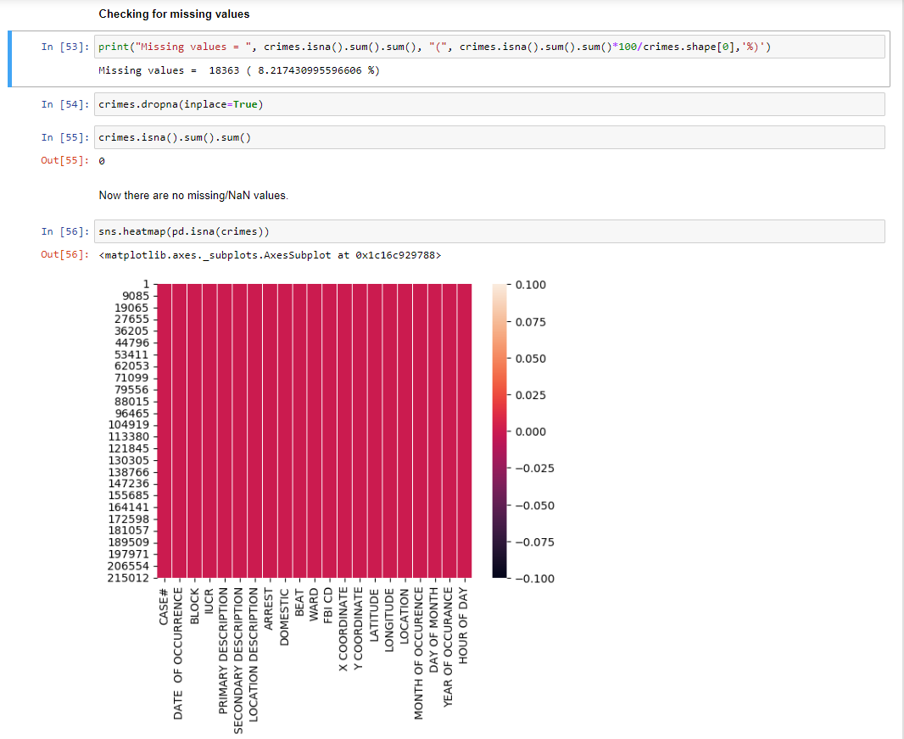
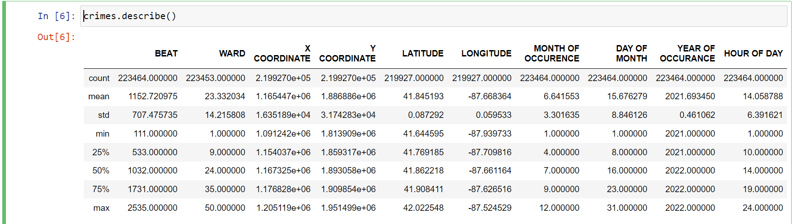
In order to extract useful values from the column _DATE OF OCCURENCE_, we created the following new columns with numerical values:
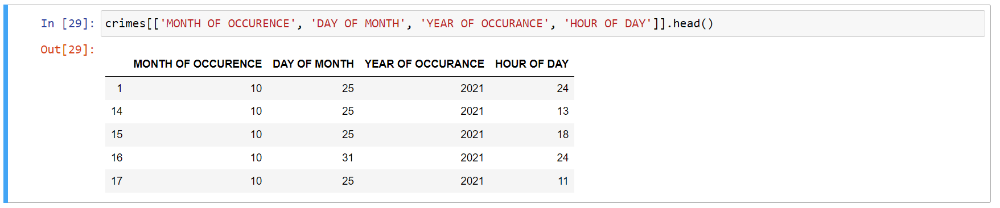
We also merged some primary descriptions to make our analysis simpler. For example, "Burglary", "Robbery", "Motor Vehicle Theft", and "Theft" can all come under the general description- "Theft".

The other two datasets- _Population - 2022_ and _Boundaries - ZIP Codes_ did not have any missing values, so no initial cleaning was required.
However, we did merge these two datasets to plot the population density for each Zip area.

## Plotting the Data
To begin, we plotted the population and crime distributions to get a general idea of their spread.
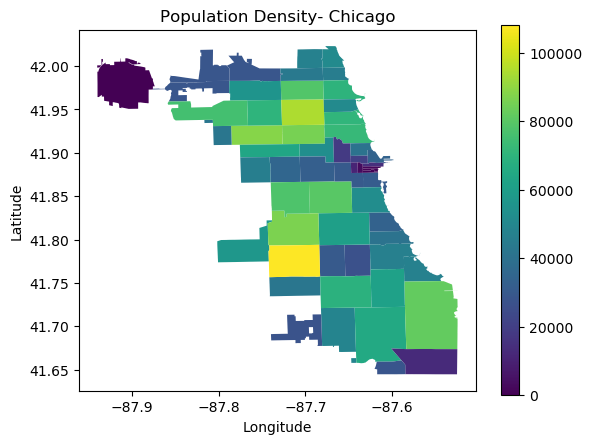
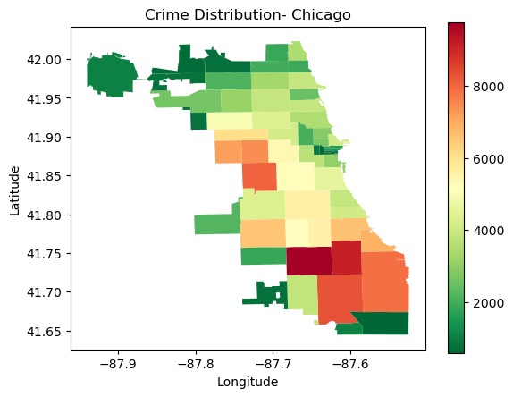

The initial observation is that two regions have particularly high crime- towards the West and South side of Chicago.

Next, upon exploring the rate of arrest for different types of crimes, the following plot was used.

We can observe the following from this bar chart:
1. Theft is the most prevalent crime, as it occurred almost 80,000 times in the last 1 year.
2. The arrest rate for Theft is extremely low. To be precise, it is 3.5%
3. The arrest rate for Drug Abuse is very high- 95% 

On this x-axis scale, the arrest rates for Prostitution and Kidnapping/Trafficking are not visible, let's take a closer look.

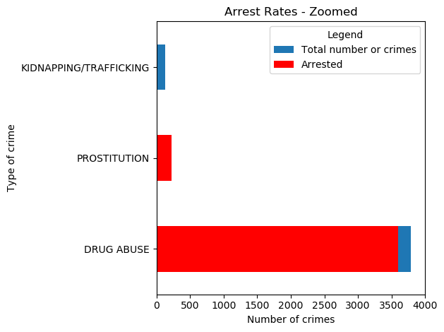

It is clearly visible that Prostitution also has a high arrest rate, 98.68% to be precise. Kidnapping/Trafficking, however, has a miniscule arrest rate of 7.14%

## Spatial Aspect

So, Drug Abuse and Prostitution are crimes with very high arrest rates. Let's take a look at their distribution by ZIP codes on the map.

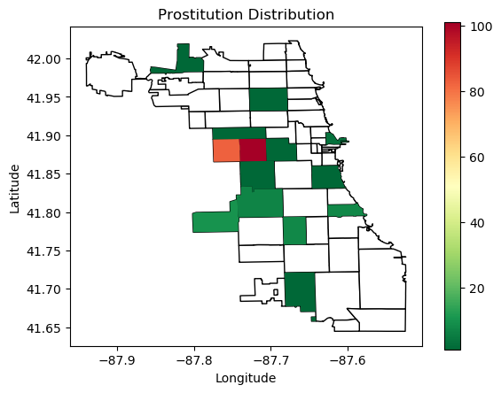
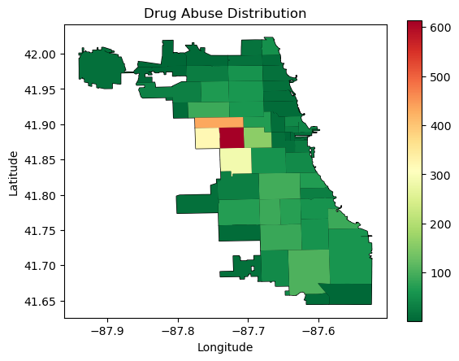

From these plots, it is apparent that both Prostitution and Drug Abuse have the same hotspot- towards the West side of the city. It is also apparent that the law enforcement agencies are vigilant in these areas and arrest a lot of perpetrators swiftly.
Following this discovery, a natural question arises- do these areas see a larger number of arrests for crimes other than Drug Abuse and Prostitution? To explore this, we can study the following plot:

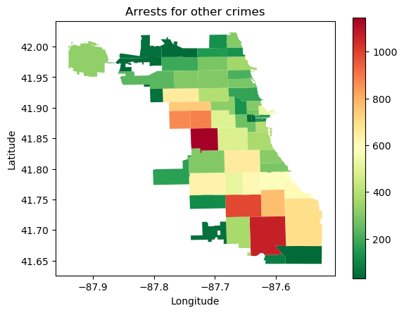

Voila! The areas of interest (-87.7, 41.85) have a considerably higher rate of arrests for crimes other than Drug Abuse and Prostitution. Another interesting finding from this plot is that there are a lot of arrests in the southern areas of Chicago.

## Temporal Data Points
We wanted to know whether seasons also affected crime rates and if so, which seasons. after doing that, we see the following graph.

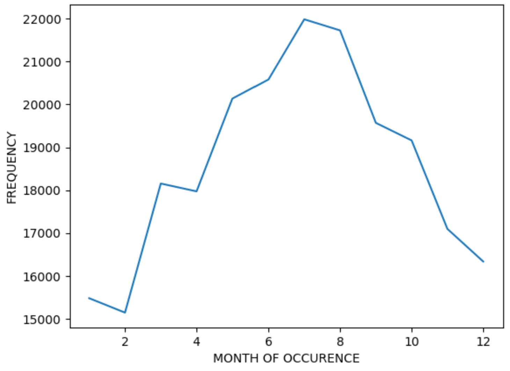

After observing the graph, we see that crimes shot up during the Spring to Summer transition and was the highest in the month of July. We can also see that the crime rate started to drop starting August (beginning of fall) and was at its lowest in February. So, we can infer that most crimes happen in the summer and can say that this is due to the fact that many people would be outside at the time and that crime rates would be at their lowest in winter when most people would not be outside a lot.

## Revisiting our Hypotheses
Coming back to our initial hypotheses:
1. The most common type of crime is theft. For example, burglary, motor vehicle theft, or any other kind of stealing.
    - Based on our explorations and observations we can conclude that theft indeed occurs with the highest frequency compared to other types of crimes.
    - Therefore, our initial hypothesis is correct!
2. Crimes related to drug abuse take place in secluded regions away from downtown.
    - We saw that most of the drug abuse cases were localised away from downtown towards the western side of Chicago.
    - Therefore, our initial hypothesis is correct!

That concludes our analysis.

